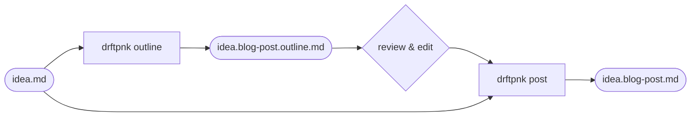
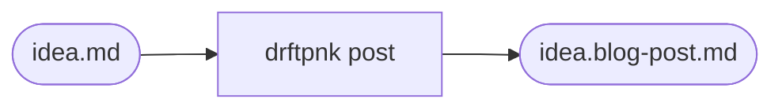
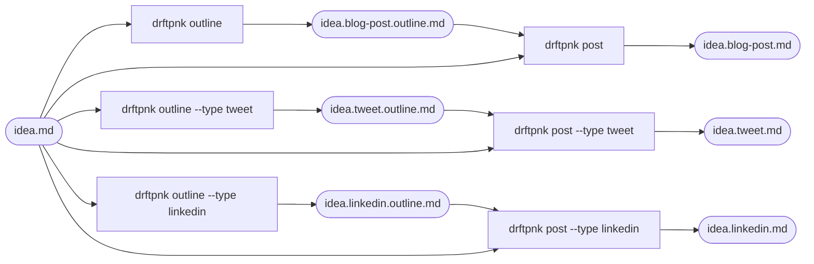
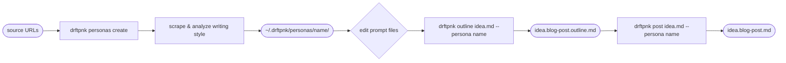
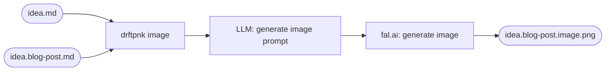

# drftpnk

**Persona-driven AI content generator**

Write blog posts, tweets, and LinkedIn posts in your voice — not a generic AI voice. drftpnk uses an outline-first workflow: generate structure, review it, then generate polished content guided by a persona style profile.

---

## Quick Start

```bash
# Install
pnpm install
pnpm build

# Link globally
npm link

# Set your API key
export OPENAI_API_KEY=sk-...
# or run: drftpnk config init

# Create an idea file
cat > idea.md << 'EOF'
# Topic
Why AI teams need taste

## Theme / Metaphor
Building taste like building a record collection

## Goals
- Explain why taste matters in AI product decisions
- Connect to venture judgment

## Key Ideas / Bullets
- Taste is pattern recognition trained over time
- Teams with taste compound their advantages
- You can't hire taste, but you can spot it
EOF

# Generate an outline
drftpnk outline idea.md
# → saves idea.blog-post.outline.md

# Review and edit the outline, then generate the full post
drftpnk post idea.md
# → saves idea.blog-post.md

# Generate an image for the post (requires FAL_KEY)
export FAL_KEY=fal-...
drftpnk image idea.md
# → saves idea.blog-post.image.png
```

---

## Usage

```
drftpnk <command> [options]
```

### Commands

| Command                     | Description                                |
| --------------------------- | ------------------------------------------ |
| `outline <idea-file>`       | Generate an outline from an idea file      |
| `post <idea-file>`          | Generate full content from an idea file    |
| `image <idea-file>`         | Generate an image for content using fal.ai |
| `config init`               | Initialize user configuration              |
| `config show`               | Show current configuration                 |
| `content-types list`        | List available content types               |
| `content-types show <type>` | Show content type details                  |
| `personas list`             | List available personas                    |
| `personas show <id>`        | Show persona details and prompts           |
| `personas set-default <id>` | Set the default persona                    |
| `personas create`           | Create a new persona (wizard)              |
| `personas update <id>`      | Update persona with new writing samples    |

### Options

```
-v, --version    output the version number
-h, --help       display help for command
```

### outline

```bash
drftpnk outline <idea-file> [options]

Options:
  -t, --type <type>      content type: blog-post, tweet, linkedin (default: from config)
  -p, --persona <id>     persona to use (default: from config)
  --force                overwrite existing outline file
  --stdout               print to stdout only, do not save
  --debug                show debug info during generation
```

### post

```bash
drftpnk post <idea-file> [options]

Options:
  -t, --type <type>      content type (default: from config)
  -p, --persona <id>     persona to use (default: from config)
  -o, --outline <file>   explicit outline file (auto-detects if omitted)
  --output <file>        explicit output file path
  --force                overwrite existing output file
  --stdout               print to stdout only, do not save
  --debug                show debug info during generation
```

### image

```bash
drftpnk image <idea-file> [options]

Options:
  -t, --type <type>          content type (default: from config)
  -p, --persona <id>         persona to use (default: from config)
  -s, --slug <slug>          image filename slug (default: "image")
  --model <model>            fal.ai model override
  --aspect-ratio <ratio>     aspect ratio override (e.g. square_hd, landscape_16_9)
  --force                    overwrite existing image file
  --debug                    show debug info during generation
```

`image` automatically looks for a matching post or outline file in the same directory as the idea file and uses it to enrich the image prompt. Use `--slug` to generate multiple images per content piece (e.g. `--slug hero`, `--slug card`).

**Requires `FAL_KEY` environment variable** (or `image.apiKey` in config).

`post` automatically looks for a matching outline file (`idea.blog-post.outline.md` for `--type blog-post`, etc.) in the same directory as the idea file. If found, it uses the outline to guide content generation. If not found, it generates content directly from the idea. Use `-o` to point to a specific outline file.

---

## Workflow

### Standard: Outline → Post

The recommended flow. Generate an outline first, review it, then generate the full post.



```bash
drftpnk outline idea.md          # → idea.blog-post.outline.md
# review and edit the outline
drftpnk post idea.md             # → idea.blog-post.md (auto-detects outline)
```

### Direct: Idea → Post

Skip the outline step. `post` generates content straight from the idea.



```bash
drftpnk post idea.md             # → idea.blog-post.md
```

### Multi-Type from One Idea

Generate multiple content types from a single idea file.



```bash
drftpnk outline idea.md                    # → idea.blog-post.outline.md
drftpnk outline idea.md --type tweet       # → idea.tweet.outline.md
drftpnk outline idea.md --type linkedin    # → idea.linkedin.outline.md

drftpnk post idea.md                       # → idea.blog-post.md
drftpnk post idea.md --type tweet          # → idea.tweet.md
drftpnk post idea.md --type linkedin       # → idea.linkedin.md
```

### Persona Setup

Create a new persona from writing samples, then use it.



```bash
drftpnk personas create
# → prompts for name, description, source URLs
# → scrapes URLs, analyzes style with LLM
# → saves ~/.drftpnk/personas/name.json + prompt .md files

# edit prompt files to fine-tune the voice
open ~/.drftpnk/personas/name/blog-post.outline.md

drftpnk outline idea.md --persona name
drftpnk post idea.md --persona name
```

### Image Generation

Generate an image for any content type using fal.ai. The image prompt is crafted by the LLM using the idea, persona image style, and any existing post or outline content.



```bash
# Generate a hero image for a blog post
drftpnk image idea.md
# → idea.blog-post.image.png  (landscape_16_9)

# Generate a Twitter card image
drftpnk image idea.md --type tweet --slug card
# → idea.tweet.card.png  (square_hd)

# Generate a LinkedIn image
drftpnk image idea.md --type linkedin
# → idea.linkedin.image.png  (portrait_4_3)

# Generate multiple images with different slugs
drftpnk image idea.md --slug hero
drftpnk image idea.md --slug thumbnail
```

**Default aspect ratios by content type:**

| Content Type | Aspect Ratio     | Notes               |
| ------------ | ---------------- | ------------------- |
| `blog-post`  | `landscape_16_9` | Hero / banner image |
| `tweet`      | `square_hd`      | Twitter card        |
| `linkedin`   | `portrait_4_3`   | LinkedIn post image |

fal.ai aspect ratio options: `square_hd`, `square`, `portrait_4_3`, `portrait_16_9`, `landscape_4_3`, `landscape_16_9`

### Debug Mode

Pass `--debug` to see what's happening at each step:

```bash
drftpnk outline idea.md --debug
```

```
  ◆ idea file: ideas/idea.md
  ◆ parsed: "Why AI teams need taste" · 2 goals · 4 key ideas
  ◆ persona: david-thyresson (David Thyresson)
  ◆ plugin: blog-post (Blog Post)
  ◆ validation: passed
  ◆ model: gpt-4o · temp 0.7 · max 4000 tokens
  ◆ prompt: 1,847 chars
  ◆ generating...
  ◆ writing: ideas/idea.blog-post.outline.md
```

### Generation Summary

After every successful save, a summary is printed showing the output file, model used, token counts, and cost:

```
  Summary
  ─────────────────────────────────────────
  file    ideas/idea.blog-post.outline.md  (1.2 KB)
  model   gpt-4o
  tokens  847 in · 1,203 out · 2,050 total
  cost    $0.0002 in · $0.0120 out · $0.0122 total
  ─────────────────────────────────────────
```

The model is also always shown in the spinner during generation: `Generating Blog Post outline as David Thyresson [gpt-4o]...`

### Preview After Save

After saving, you're prompted to preview or page through the output:

```
◆ Saved to idea.blog-post.outline.md
● Preview  (print to terminal)
  More     (open in pager)
  Done
```

### Stdout Only

```bash
drftpnk outline idea.md --stdout    # streams to terminal, no file saved
drftpnk post idea.md --stdout       # streams to terminal, no file saved
```

---

## idea.md Format

```markdown
# Topic

<one-line topic statement>

## Theme / Metaphor

<central metaphor or framing device>

## Goals

- <goal 1>
- <goal 2>

## Key Ideas / Bullets

- <key idea 1>
- <key idea 2>

## Possible Titles

- <title option 1>
- <title option 2>

## References / Examples

- <reference or example>

## Audience

<target audience description>

## Word Count Target

900
```

**Required sections**: Topic, Theme / Metaphor, Goals, Key Ideas / Bullets

Missing a required section exits immediately with:

```
Error: Missing required section "Theme / Metaphor" in idea.md
```

---

## Configuration

Config is loaded from (in order, project overrides user):

1. `~/.drftpnk/config.json` (user-level)
2. `.drftpnk/config.json` (project-level)

```json
{
  "default_persona": "david-thyresson",
  "default_content_type": "blog-post",
  "output_dir": ".",
  "outline": {
    "auto_save": true,
    "naming_convention": "idea.{type}.outline.md",
    "require_outline_for_post": false
  },
  "llm": {
    "provider": "openai",
    "model": "gpt-4o",
    "temperature": 0.7,
    "maxTokens": 4000
  }
}
```

**API key resolution**: `OPENAI_API_KEY` env var → config `llm.apiKey` → error

**fal.ai API key resolution**: `FAL_KEY` env var → config `image.apiKey` → error

### Image Generation Configuration

```json
{
  "image": {
    "model": "fal-ai/nano-banana-2"
  },
  "image_by_content_type": {
    "tweet": {
      "model": "fal-ai/nano-banana-2",
      "aspect_ratio": "square_hd"
    },
    "linkedin": {
      "aspect_ratio": "portrait_4_3"
    }
  }
}
```

Use `image_by_content_type` to assign different models or aspect ratios per content type.

### Per-Content-Type LLM Model Overrides

Use `llm_by_content_type` in config to assign different models to different content types:

```json
{
  "llm": {
    "provider": "openai",
    "model": "gpt-4o",
    "temperature": 0.7,
    "maxTokens": 4000
  },
  "llm_by_content_type": {
    "tweet": { "model": "gpt-4o-mini", "maxTokens": 500, "temperature": 0.9 },
    "linkedin": { "model": "gpt-4o-mini" }
  }
}
```

Only the fields you specify are overridden — unset fields fall back to `llm` defaults.

---

## Personas

Each persona has a JSON config file and a directory of `.md` prompt files. This makes prompts easy to read, edit, and version control.

### File Structure

```
personas/
└── david-thyresson.json          # persona config (style, do_not, source_urls)
└── david-thyresson/
    ├── system_prompt.md          # how to write as this person
    ├── blog-post.outline.md      # outline prompt template
    ├── blog-post.content.md      # content prompt template
    ├── tweet.outline.md
    ├── tweet.content.md
    ├── linkedin.outline.md
    └── linkedin.content.md
```

Personas are loaded from two locations (project takes precedence over user-level):

- `personas/` — project-level, committed to the repo
- `~/.drftpnk/personas/` — user-level, global across projects

### Create a Persona

```bash
drftpnk personas create
```

The wizard prompts for name, description, and source URLs. It scrapes the URLs, analyzes the writing style with the LLM, and generates a style profile and `system_prompt`. Prompt `.md` files are scaffolded from defaults — edit them to customize the voice.

### Update a Persona

```bash
drftpnk personas update david-thyresson --url https://example.com/new-post
```

Scrapes the URL and merges new style analysis into the existing persona.

### Show a Persona

```bash
drftpnk personas show david-thyresson
```

Displays style, tone rules, do-not list, system prompt, and all prompt templates in readable form.

### Per-Persona Model Overrides

Personas can specify their own model preferences in their JSON file. Use `llm` for a persona-wide default, and `llm_by_content_type` for per-content-type overrides within that persona:

```json
{
  "id": "david-thyresson",
  "llm": {
    "model": "gpt-4o"
  },
  "llm_by_content_type": {
    "tweet": { "model": "gpt-4o-mini", "temperature": 0.95 },
    "linkedin": { "model": "gpt-4o-mini" }
  }
}
```

**Resolution order** (most specific wins):

| Priority    | Source                              | Example                         |
| ----------- | ----------------------------------- | ------------------------------- |
| 1 (lowest)  | `config.llm`                        | global default                  |
| 2           | `config.llm_by_content_type[type]`  | all personas, this content type |
| 3           | `persona.llm`                       | this persona, all content types |
| 4 (highest) | `persona.llm_by_content_type[type]` | this persona, this content type |

Only the fields you specify are overridden — unset fields fall back to the next level. For example, setting `persona.llm.model` only changes the model; temperature and maxTokens still come from `config.llm`.

### Persona JSON Structure

```json
{
  "id": "david-thyresson",
  "name": "David Thyresson",
  "description": "Venture investor, tech culture writer at PWV",
  "style": {
    "voice": ["reflective", "confident", "warm"],
    "domains": ["venture", "startups", "AI"],
    "signature_devices": ["extended metaphor", "cultural reference", "contrast pairs"],
    "tone_rules": ["sound like a thoughtful investor, not a hype marketer"]
  },
  "image_style": {
    "art_style": ["editorial illustration", "flat design", "muted tones"],
    "color_palette": ["deep navy", "warm amber", "off-white"],
    "mood": ["contemplative", "grounded", "intellectually curious"],
    "negative_prompt": "no text, no logos, no people, no photorealism, no bright neon colors"
  },
  "do_not": ["use buzzwords like 'synergy'", "use passive voice"],
  "source_urls": []
}
```

`system_prompt` and all `prompts` live in the sibling `.md` files — not in the JSON.

### Custom Image Prompt Template

Create `personas/{id}/image.md` to override the default image prompt generation. Supports `{{topic}}`, `{{theme}}`, `{{goals}}`, `{{plugin_name}}`, and `{{context}}` variables:

```
personas/david-thyresson/
└── image.md    ← custom image prompt template
```

### Prompt Templates

Prompt `.md` files support `{{variable}}` substitution:

| Variable                  | Value                                    |
| ------------------------- | ---------------------------------------- |
| `{{topic}}`               | Idea topic                               |
| `{{theme}}`               | Idea theme / metaphor                    |
| `{{goals}}`               | Goals (joined)                           |
| `{{keyIdeas}}`            | Key ideas (joined)                       |
| `{{possibleTitles}}`      | Possible titles (joined)                 |
| `{{references}}`          | References (joined)                      |
| `{{audience}}`            | Target audience                          |
| `{{wordCountTarget}}`     | Word count target                        |
| `{{voice}}`               | Persona voice (joined)                   |
| `{{signature_devices}}`   | Signature devices (joined)               |
| `{{tone_rules}}`          | Tone rules (joined)                      |
| `{{system_prompt}}`       | Full system prompt                       |
| `{{do_not}}`              | Do-not rules (joined)                    |
| `{{persona_name}}`        | Persona name                             |
| `{{persona_id}}`          | Persona ID                               |
| `{{persona_description}}` | Persona description                      |
| `{{outline}}`             | Generated outline (content prompts only) |
| `{{plugin_name}}`         | Plugin name                              |
| `{{plugin_word_count}}`   | Plugin word count target                 |

---

## Content Types

| ID          | Name          | Word Count | Notes                   |
| ----------- | ------------- | ---------- | ----------------------- |
| `blog-post` | Blog Post     | ~900 words | YAML frontmatter output |
| `tweet`     | Tweet         | 280 chars  | Plain text output       |
| `linkedin`  | LinkedIn Post | ~400 words | Plain text output       |

---

## Project Structure

```
drftpnk/
├── personas/
│   ├── david-thyresson.json      # persona config
│   └── david-thyresson/
│       ├── system_prompt.md
│       ├── blog-post.outline.md
│       ├── blog-post.content.md
│       ├── tweet.outline.md
│       ├── tweet.content.md
│       ├── linkedin.outline.md
│       └── linkedin.content.md
├── src/
│   ├── cli.ts
│   ├── generator.ts
│   ├── debug.ts                      # debug logger (--debug flag)
│   ├── commands/
│   │   ├── outline.ts
│   │   ├── post.ts
│   │   ├── image.ts
│   │   ├── config.ts
│   │   ├── content-types.ts
│   │   ├── personas.ts
│   │   └── index.ts
│   ├── idea/
│   │   ├── parser.ts
│   │   └── types.ts
│   ├── llm/
│   │   ├── types.ts
│   │   ├── factory.ts
│   │   ├── pricing.ts                # model pricing + cost calculation
│   │   └── providers/
│   │       ├── base.ts
│   │       └── openai.ts
│   ├── plugins/
│   │   ├── types.ts
│   │   ├── registry.ts
│   │   ├── blog-post.ts
│   │   ├── tweet.ts
│   │   ├── linkedin.ts
│   │   └── index.ts
│   ├── personas/
│   │   ├── index.ts
│   │   └── types.ts
│   ├── config/
│   │   ├── loader.ts
│   │   └── types.ts
│   ├── image/
│   │   ├── types.ts                  # ImageConfig, ImagePromptResult, ImageGenResult
│   │   ├── prompt.ts                 # LLM-based image prompt generation
│   │   └── fal.ts                    # fal.ai client wrapper
│   └── output/
│       ├── formatter.ts
│       ├── writer.ts
│       ├── preview.ts                # post-save preview prompt
│       └── summary.ts                # generation summary display
├── .env                          # OPENAI_API_KEY, FAL_KEY (not committed)
├── package.json
├── tsconfig.json
├── tsup.config.ts
└── README.md
```

---

## Setup

```bash
# Install dependencies
pnpm install

# Build
pnpm build

# Link for local development
npm link

# Set API keys (pick one approach per key)
export OPENAI_API_KEY=sk-...
export FAL_KEY=fal-...
# or
echo "OPENAI_API_KEY=sk-...\nFAL_KEY=fal-..." > .env
# or
drftpnk config init

# Run tests
pnpm test
```
